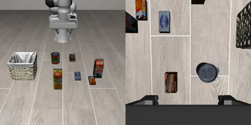
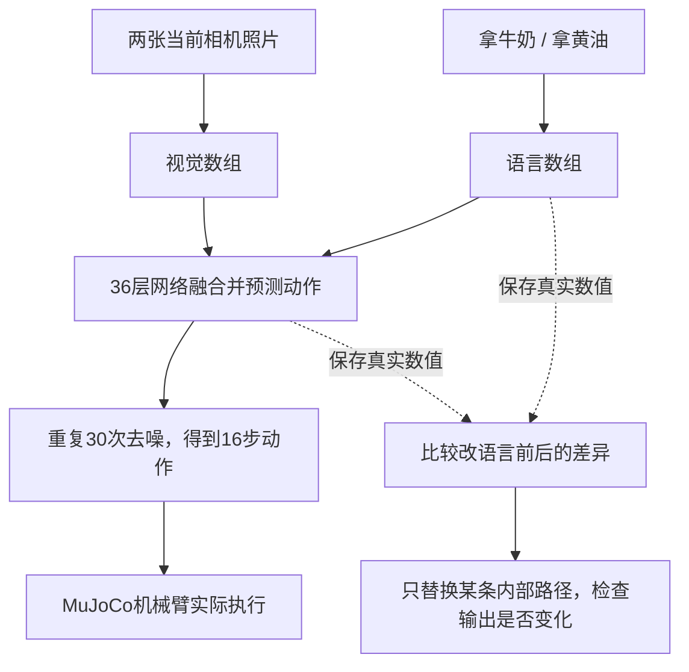
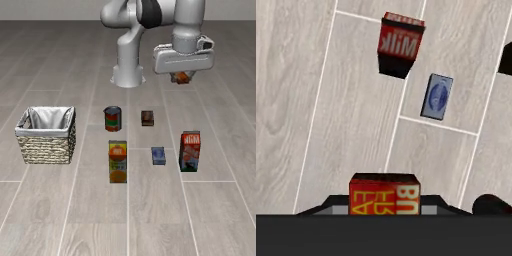

# Cosmos3 Policy 实验笔记

[打开中文实验网页](https://zcxixixi.github.io/cosmos3-policy-experiments/)。首页先说明现在查什么、实际做到哪一步，以及最近的录像；计算细节可展开查看。

首页只展示当前目标、真实进度和最近完成的实际实验。以下历史记录与[讲解动画](docs/media/experiment-summary.mp4)、[字幕](docs/media/experiment-summary.srt)留在仓库供核验。

我们让机械臂“拿牛奶放进篮子”。它有时抓牛奶，有时却抓奶酪盒。改成“拿黄油”，它也常常继续抓原来的东西。

我想弄清楚：它是不是记住了某种场景下的动作？是不是没识别出目标？还是我们说的话进入了网络，却没有有效控制它抓谁？这里记录每次怎么试、真实结果是什么，以及我们查到哪一步了。

测试对象是社区微调权重 [`fwd4xl/cosmos3-nano-policy-liberoall-5k`](https://huggingface.co/fwd4xl/cosmos3-nano-policy-liberoall-5k)。这是这个权重和自定义推理程序的实验记录，不能代表所有 Cosmos 模型。没有为这些诊断重新训练模型。

## 当前目标与进度（2026-10-05）

原始问题仍未解决：同一句“抓牛奶”，牛奶移远后为什么转抓奶酪盒？还没有定位出决定该失败的内部组件，也没有修好原始milk／15厘米条件。

**最新完成8条实际执行，直接检验末层内部机制。** 在能按名称分别抓对目标的15厘米／未来噪声198配对中，双向替换第36层供动作读取的文字数组，并比较正常MLP、保持同输入原生MLP响应、自身替换和随机方向四种条件。首轮30次去噪全程干预，后续7轮正常推理。

结果：四种条件下，牛奶盒指令仍抓牛奶（64–68），奶酪盒指令仍抓奶酪（67–71）。只改这一接口不足以换目标；固定MLP也没有换目标。首个去噪时刻，注意力与MLP变化方向余弦为−0.035／−0.043，合起来的变化长度为注意力变化的2.17／2.13倍，不支持简单的反向抵消解释。长度和方向不是物体语义，不能据此定位“牛奶脑区”。

真实核验覆盖240处内部捕获、64份预测和1024条实际控制命令；两条自身替换完整执行与自然参考逐字节一致。全部数组、视频、代码和启动失败日志公开。下一步待检验“目标是否更早已稳定”，尚未运行；本轮没有新增训练。

[最新普通中文网页与单条视频](https://zcxixixi.github.io/cosmos3-policy-experiments/#latest) · [本轮8条实验与复现](experiments/18-instruction-interaction/README.md) · [真实内部数组](experiments/18-instruction-interaction/instruction-interaction-analysis/arrays.npz) · [原始文件清单与SHA](experiments/18-instruction-interaction/publication-manifest.json)

## 先看结果

| 我们改了什么 | 机械臂实际做了什么 |
|---|---|
| 原始布局，说“拿牛奶” | 抓起牛奶 |
| 同样的布局，改说“拿黄油” | 仍抓起牛奶 |
| 牛奶沿 X 轴移动 6 cm，说“拿牛奶” | 能跟着新位置抓起牛奶 |
| 牛奶沿 X 轴移动 15 cm，说“拿牛奶” | 改抓奶酪盒，牛奶没动 |
| 牛奶和黄油互换位置，说“拿牛奶”或“拿黄油” | 两次都抓奶酪盒 |

“抓起”只表示接触并抬起物体，不能当成整个放入篮子任务成功。上表是固定种子的个案，不是成功率统计。

实验10做了一个更直接的对照：**牛奶移远后保持不动，把奶酪盒和黄油的位置互换。机械臂没有追着奶酪盒走，而是抓了奶酪盒旧位置上的黄油。**牛奶还在原位置时，交换这两个干扰物，它仍抓牛奶。四种布局各换三个推理随机种子重复，抓起的物体每种都一致。

这支持“摆放位置在影响目标选择”，还不能说它在所有场景里只去一个固定点，更不能证明它背了某条训练轨迹。三种噪声重复使用同四份初态，不是十二种独立场景。未交换的原始布局三条执行中两条触发牛奶入篮检查，另外九条在128步结束时没有触发；抓起和放置要分开看。[看四种画面、视频和逐步数据](experiments/10-identity-position/README.md)。

我们也发现程序比官方动作示例多了一段开场文字，去掉后仍出现相同的目标选择错误。这段多余文字不能单独解释失败；完整官方推理路径的交叉核验还没有结束。[输入格式对照](experiments/09-system-prompt/README.md)。

补做输入核验：按公开官方代码改了照片处理方式和默认推理时间表，再跑原位／移远、拿牛奶／拿黄油四条执行，**抓起的对象仍与旧设置一致**。原位两句都抓牛奶，移远两句都抓奶酪盒。这两处修正没有纠正这四条的目标选择，完整官方流程仍未全部核验。[看新录像、四行对照和真实数组](experiments/12-pixel-schedule/README.md)。

实验13去内部查了两种影响方式：**文字直接影响动作，以及文字先影响预测画面、再影响动作。**两种方式都让动作数字改变；把画面读取的变化固定住，动作全过程逐项回到原结果。但六条实际执行仍是原位抓牛奶、移远抓奶酪盒，没有改抓黄油。因此，“语言完全没传进动作计算”解释不了当前数据；为什么没按名称选物体，还没有定位。[看人话说明、六条录像和真实数组](experiments/13-language-routes/README.md)。

**新增π0.5实际对照：原位说“拿黄油”，仍抓牛奶；牛奶移远后，两句指令让机械臂走出不同路线，但两条都没抓起物体。**因此，“换语言完全没用”和“动作没做好”需要分开判断。这是两份固定初态、一个配对种子的四条执行，不是模型排名；输入、原生动作和实际轨迹都保存了。[看四条视频、轨迹图和结论](experiments/14-pi05-target-control/README.md)。

**新找到的 Cosmos 对照：同一个碗／酒瓶初态，说碗抓起碗，说酒瓶抓起酒瓶。**没有重新训练或替换内部数组。两条最后都没完成柜顶放置，但这说明当前模型在这组场景里确实能按语言换目标，不能把牛奶场景的失败概括成“一律忽略语言”。原牛奶→黄油测试保留牛奶任务的布局、只换目标，不是官方黄油任务；碗／酒瓶两任务的物理配置相同。这次只有一个共同初态、一组配对噪声，不是成功率。下一步用这个自然抓对目标的对照检查内部信息。[看两条实际录像、输入与完整张量](experiments/15-native-goal-targets/README.md)。

点击下面的画面看 **牛奶移动 15 cm 后的实际执行视频**：

GitHub 若没有直接播放，可下载 MP4。录像来自 MuJoCo 执行；这里没有用生成视频冒充机械臂真的做到了。

## 我们怎么去网络里面查？

模型把照片和文字变成数组，再一层层算出动作。我们保存这些真实数组，并在保持画面、噪声等条件相同的情况下，比较“拿牛奶”和“拿黄油”。

这里的两张照片是固定相机和手腕相机，各 256×256。**36 个网络层**和**30 次去噪**是两回事：每次去噪都会经过全部网络层。

## 内部实验查到了什么？

### 1. 我们的话确实进去了，也影响了动作分支

新增实验比较两种布局、两句目标指令、三个随机种子，共 12 组完整动作预测。整个 30 次去噪过程都保存了动作头前的数组。

原始布局中，换“牛奶 / 黄油”让第一次去噪时用于计算动作的中间数组相对变化约 **2.0%**，最后一次约 **8.6%**。因此，“语言在中间完全没了”这个解释不符合数据。

这些百分比只表示数组变化幅度，不能翻译成“理解了 8.6%”。内部对一个词有反应，也不等于它知道该抓哪个物体。

### 2. 语言信息不只待在“牛奶”这个词的位置

我们又做了 80 组内部路径替换。在相同动作和视觉输入下，只让视频和动作生成过程读另一条指令的内部数据，分别替换目标词、目标词之前的文本、目标词之后的文本。

后期，只换“牛奶”那一个词的内部数据，效果很有限；换它后面的文本状态，反而更接近完整换指令的效果。因为文本网络会把前面的信息传给后面的 token，只盯着“牛奶”一词的注意力会漏掉传递路径。

替换目标词之前的文本，输出变化精确为零；替换全部文本读取路径，精确复现另一条指令的输出。这两个对照说明，我们确实改到了模型在用的路径。

### 3. 整块搬来“能抓牛奶”的内部数组，带不来稳定的“抓牛奶”能力

我们把原始布局中、实际能抓起牛奶的运行作为来源，把它第 30 层的动作数组放进牛奶和黄油互换后的场景。只干预第一轮动作预测，后面恢复正常推理。

结果：机械臂改抓了黄油。黄油正位于原来牛奶的位置。

再把来源牛奶移动 6 cm，取同一层的数组，用相同方法替换到同一个接收场景，结果又改抓奶酪盒。

所以，这些数组的作用明显依赖来源布局，不能直接当成一个通用的“牛奶概念”搬来搬去。它们可能混合了位置、运动和物体相关信息。跨场景整块替换也可能扰乱网络，所以我们没有把它当成已经找到唯一根因。

### 4. 前期换语言通常影响更大，但后期也有影响

新增 30 组完整预测，只在前、中、后各 10 次去噪中，让视频和动作生成过程读“拿黄油”的文本数据，其余阶段仍读“拿牛奶”。全程原样运行和全程换语言都精确复现了已有结果。

在牛奶移动 15 cm 的场景里，前 10 次换语言造成的最终 XYZ 数值变化，平均比后 10 次大。不过，这些数值变化总体仍小。这组实验没有执行新的闭环录像，不能说它让机械臂改抓了正确目标。

## 现在怎么理解这个问题？

**目前更符合数据的说法是：这个策略会根据场景调整动作，语言也参与计算。牛奶／黄油测试中，它没能按名称换对目标；同画面的碗／酒瓶测试中，它能抓起各自对应的物体，但最后没放好。**失败需要结合具体场景和任务关系解释。

“它记住了答案”是一个值得继续验证的解释，还不是已经证实的事实。我们没有核对到这份权重实际用过的全部训练示范，也没证明它复现了其中某一条轨迹。

还有一个背景：LIBERO 的这个牛奶任务默认把目标放在一个约 5 cm 宽的 X 区域里。移动 15 cm 已超出这个任务的默认摆放范围。这有助于解释为什么小幅移动能适应、大幅移动会失败，但不能证明该权重训练时只看过这个区域。任务配置保存在 [这里](provenance/libero-milk-task.bddl)。

## 每个实验的图、视频和数据

| 记录 | 问题 |
|---|---|
| [01 改指令和空指令](experiments/01-language-and-empty/README.md) | 不说话、让它张开或闭合，结果一样吗？ |
| [02 移动牛奶](experiments/02-object-position/README.md) | 能不能跟随小幅位置变化？ |
| [03 交换物体位置](experiments/03-target-swap/README.md) | 它跟着物体身份走，还是看布局选动作？ |
| [04 替换内部数组](experiments/04-state-exchange/README.md) | 把会抓牛奶的运行搬进去，会抓谁？ |
| [05 改来源位置](experiments/05-donor-position/README.md) | 换进去的数据有多依赖来源位置？ |
| [06 牛奶移动15厘米](experiments/06-milk-moved-15cm/README.md) | 正常推理在更大位移下会怎样？ |
| [07 语言在内部怎么传](experiments/07-language-path/README.md) | 目标词的信息经过什么路径影响动作？ |
| [08 语言何时起作用](experiments/08-language-timing/README.md) | 前期、后期改指令，影响有区别吗？ |
| [09 输入格式对照](experiments/09-system-prompt/README.md) | 去掉多余开场文字，抓错目标会消失吗？ |
| [10 抓奶酪还是抓那个位置](experiments/10-identity-position/README.md) | 交换奶酪和黄油后，它会跟着谁走？三个种子重复。 |
| [11 官方网络计算核验](experiments/11-official-transformer/README.md) | 同一份已编码输入交给官方网络，四组各算30次，动作数值是否接近？未跑新闭环。 |
| [12 按官方方式处理输入](experiments/12-pixel-schedule/README.md) | 改正照片处理和默认时间表，四条实际执行抓谁变了吗？ |
| [13 语言影响动作的两种路线](experiments/13-language-routes/README.md) | 直接读文字、经过预测画面，哪种会改变动作？六条执行抓谁？ |
| [14 换π0.5实际执行](experiments/14-pi05-target-control/README.md) | 同样的摆放下，换目标名称会改变路线和抓取对象吗？ |
| [15 同一画面，说碗抓碗，说酒瓶抓酒瓶](experiments/15-native-goal-targets/README.md) | Cosmos能正常按语言换抓取目标吗？两条都抓对，但最后没放好。 |

[下载并打开离线报告](report.html)，可以逐个播放之前的实验视频。新增的 07–15 以本仓库和中文网页为准，离线 HTML 尚未加入这些更新。

[相关论文与方法限制](notes/literature.md)解释为什么“能从数组读出信息”“替换数组后动作改变”和“找到了出错原因”是不同层次的证据。已有的 [Cosmos 官方讨论](https://github.com/NVIDIA/cosmos/discussions/369)保留了早期夹爪实验；本仓库记录后续实验。

## 如何核验与继续

- [推理设置](provenance/runtime.md)：具体权重、代码版本、输入和动作格式。
- 每个实验目录保留 JSON 数值，视频目录保留动作和机械臂轨迹；[manifest.json](manifest.json)记录文件校验值。
- [scripts/archive](scripts/archive)保存实际使用的脚本快照。里面保留原 A6000 环境路径，需要按说明配置，不能直接承诺在任意电脑上一键复现。

下一步把能重复的目标选择，与网络内部的具体传递路径对应起来：什么信息让它转向旧位置？只改变这部分信息，能否让它选择牛奶？同时继续核对官方推理实现，避免把输入或实现差异当成模型机制。我们会记录支持和推翻猜想的结果。
