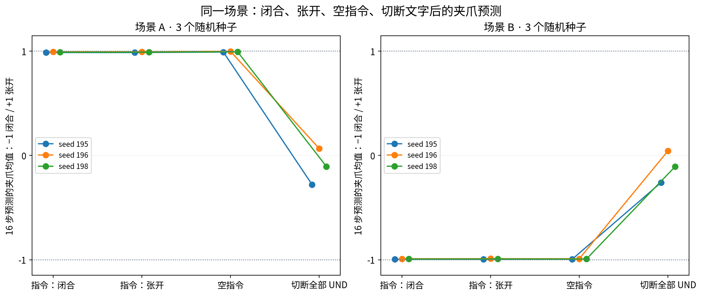

# 改指令、空指令：它会听夹爪要求吗？

我们担心机械臂只根据画面决定张开或闭合，于是固定画面，分别输入“张开夹爪”“闭合夹爪”和空指令。其他设置保持匹配，重复三个随机种子。

悬空画面中，三种指令都输出张开；靠近牛奶的画面中，三种都输出闭合。张开和闭合指令只改变一个实际文本 token，内部动作数组会变，但没有翻转最终夹爪方向。

这说明这些独立夹爪指令在这两个视觉状态下控制较弱。它们可能超出这个任务微调模型的指令分布，所以我们后来补了“拿牛奶 / 拿黄油”的任务式对照。

这里是离线预测的夹爪命令，不是物理夹爪宽度。归一化约 +1 表示张开，约 −1 表示闭合。原生 MuJoCo 命令的符号相反。

[result.json](result.json)保留完整结果，[真实动作头前数组比较](feedback/evidence/readout_comparison.json)保留内部数值。额外的 Goal 场景换指令确实改变动作，不能说整个模型对所有语言都无效。
