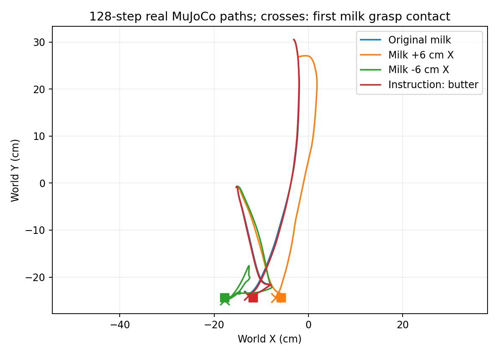

# 牛奶移动6厘米：能跟着物体走吗？

原始环境中，牛奶沿 X 正负方向移动6厘米，其他物体和机械臂保持相同。都说“拿牛奶”，用匹配的随机种子执行128步。

原位置和 X+6厘米都抓起牛奶。X−6厘米到第128步才出现抓取接触，尚未抬起，不能称为稳定成功。同一原始画面改说“拿黄油”，仍抓牛奶。

这说明它至少能适应一部分位置变化，不能概括为始终照抄一条固定轨迹；但目标名称没有有效控制这组运行。

- [原位置、指令拿牛奶](center-milk/actual.mp4)
- [原位置、指令拿黄油](center-butter/actual.mp4)

[场景改动](inputs/metadata.json)、[实际执行结果](closed-loop/result.json)、[内部视觉与动作路径替换](causal/result.json)。最后一项只测首次去噪的 Flow 输出，不能当作闭环成功。
