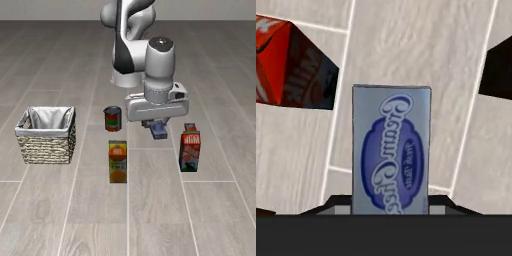
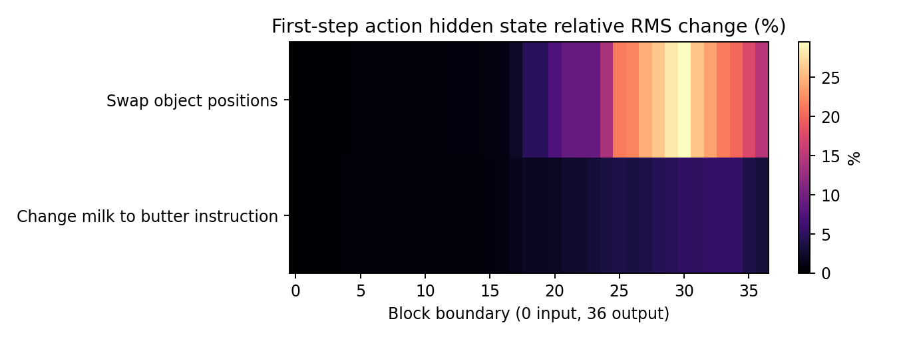

# 牛奶和黄油换位置：它最后抓谁？

我们只交换两个物体的 XY 位置，保留它们各自的高度和朝向，其他初态相同。分别说“拿牛奶”和“拿黄油”，各执行128步。

两条指令都让它抓起第三个物体：奶油奶酪盒。牛奶和黄油都没被抓起。

[拿牛奶的视频](swapped-milk/actual.mp4) / [拿黄油的视频](swapped-butter/actual.mp4)。

第一次去噪，输出头前的内部数组因换布局变化约12.01%，因换目标名称变化约2.04%。最终归一化 XYZ 动作差异分别为0.178919和0.010533，约17倍。17倍是最终动作的差异比，不是内部热力图的数值。

这些百分比不能当成理解程度或概率。两种扰动的幅度和基准不同，这个比值也不是一般性的视觉/语言重要性常数。

[物体接触和抬起数据](quantified.json) / [内部数值](latent.json)。
