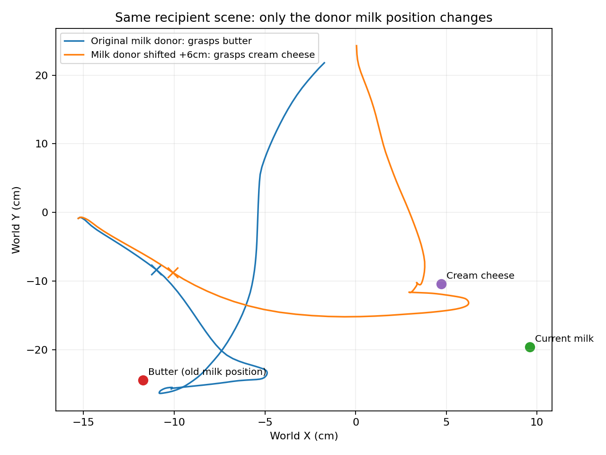

# 来源牛奶再移动6厘米，搬来的数组会有什么不同？

接收场景、指令、随机种子和替换方法不变。只把来源场景中的牛奶沿 X 移动6厘米，再取第30层数组。两个来源的正常运行此前都实际抓起过牛奶。

原位置来源让接收者抓黄油；移动后的来源让接收者抓奶酪盒。两次都没有抓接收场景的牛奶。

来源数组相对变化16.7%。接收者第一轮动作执行结束时，X 相对对照变化+9.1mm，而不是直接平移60mm。

[新视频](shifted-donor/actual.mp4) / [数值与相同初态检查](result.json)。

能确认的是，替换作用依赖来源布局。后续视觉反馈可能把早期运动差异放大为不同抓取行为；这仍不足以证明模型里只有坐标、没有物体身份。
