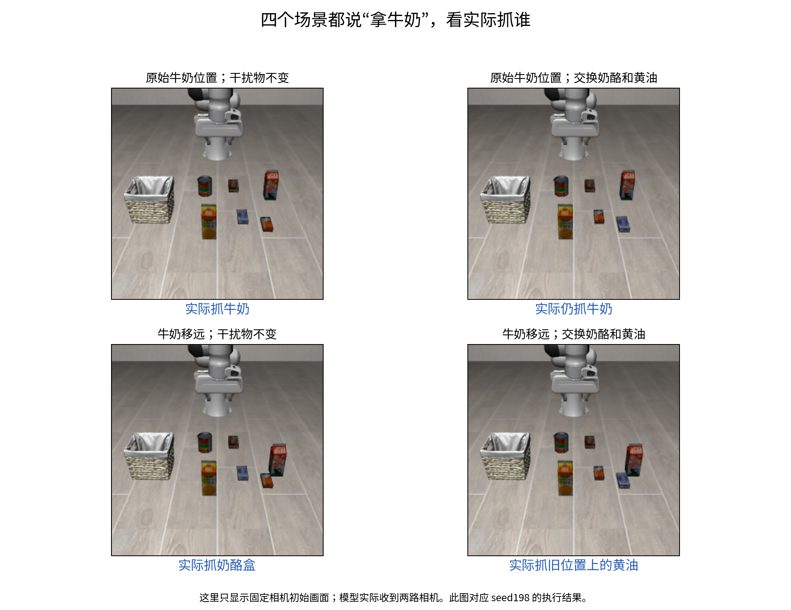

# 10：牛奶移远后，跟着奶酪盒走，还是抓它原位置上的东西？

在这四种布局、三个噪声种子中：牛奶在原位置时都抓牛奶；牛奶移远15厘米后都抓奶酪盒；保持牛奶移远，只交换奶酪盒和黄油的位置后，都改抓原奶酪位置上的黄油。所有指令始终是“拿牛奶并放进篮子”。

我们怀疑此前的抓错有两种解释：模型偏向奶酪盒这个物体，或者在牛奶移远的条件下偏向奶酪盒原来的位置。此前奶酪盒一直没动，两种解释分不开。于是固定牛奶的位置，只交换奶酪盒与黄油的水平位置；再在牛奶仍处于原位置的场景中做同样交换，检查这一操作是否会把原本正确的抓取也改坏。

怎么改：四种布局全部关闭[实验09排查的额外系统提示](../09-system-prompt/README.md)，不替换模型内部状态。交换时只改两件物体各自的 X、Y，保留各自高度和朝向，以及牛奶、机器人和其他物体的初态。初态检查没有发现物体间接触。下图是四个初始画面；实际模型还同时收到腕部相机画面。

实际抓了谁：

| 牛奶位置 | 奶酪盒／黄油位置 | 种子195 | 种子196 | 种子198视频 |
|---|---|---|---|---|
| 原位置 | 不交换 | 牛奶 | 牛奶 | [抓牛奶](../09-system-prompt/closed-loop/center_milk_off/actual.mp4) |
| 原位置 | 交换 | 牛奶 | 牛奶 | [仍抓牛奶](center_cream_butter_swap_milk_off/actual.mp4) |
| 移远15厘米 | 不交换 | 奶酪盒 | 奶酪盒 | [抓奶酪盒](../09-system-prompt/closed-loop/far_milk_off/actual.mp4) |
| 移远15厘米 | 交换 | 黄油 | 黄油 | [抓原奶酪位置上的黄油](far_cream_butter_swap_milk_off/actual.mp4) |

这里共12条实际执行，每条128步。种子198的两个未交换场景复用实验09；两个交换场景是实验10先做的执行；随后在这四个相同初态上补了种子195和196，共新增8条。没有把复用数据算成新的执行，也没有重新抽取12个物体布局。

这说明，在牛奶移远的这组条件下，被抓对象随原奶酪位置的占据者改变：那里放奶酪就抓奶酪，换成黄油就抓黄油。它反对“无论放哪里都跟着奶酪盒走”的简单解释，支持这个条件下位置安排影响目标选择。牛奶还在原位置时，两种干扰物安排都抓牛奶，所以也不能说模型在每个场景都只抓同一个固定点。

尚不能断言这是训练记忆。我们没有取得这份权重的完整训练样本，也没有证明模型内部存在一条固定位置规则。交换同时改变了可见外观、物体形状和周围关系，没有把这些因素拆开；奶酪盒移到新位置后的可抓性，也没有用“拿奶酪”指令单独验证。这里仅测试“拿牛奶”一条指令，不能据此认定模型能按语言可靠区分物体身份。

三个种子只改变同一批场景中的采样噪声，不是三个独立任务或随机初态。这些记录用于检查抓取对象是否重复出现，不能换算成总体成功率。抓起对象和按要求放进篮子是两件事；当前调用与官方完整运行方式的等价性也尚未证明。

[初态改动和接触检查](controls.json)、[首轮两个交换结果](result.json)、[新增8条结果](repeats/result.json)保留核验依据。每条执行的原始轨迹和视频列在末尾。

[12条执行的严格汇总](summary.json)要求双侧夹爪接触和抬高超过2厘米同时连续保持5条记录，重新核验后，抓起对象仍与上表一致。

**数值与复核细节**

奶酪盒原始 XY 为 `(0.0470868, -0.1041659)` 米，黄油为 `(0.0959509, -0.1962213)` 米。两个交换初态都只有完整状态数组中的 `[24,25,38,39]` 四项改变，对应两件物体的 X、Y；各自高度和朝向保留，机器人与其余物体状态一致。[controls.json](controls.json)保留完整精度和改动数组。牛奶移远是 X 增加0.15米，不改变其 Y。

新增8条执行还原首轮的对应初态，首张双相机输入逐像素一致。所有12条查询记录均明确关闭系统提示；每条执行查询8次，每次执行16个动作，查询种子为表中起始种子加查询编号。同布局不同种子的初始物体坐标和图片已重新比对，接触与抬起数值也从全部129帧轨迹重算。

下表的首次抓取是模拟器抓取接触判据首次成立的步数；抬起是物体高度相对初始值的最大增量。它们用于确认抓了谁，不等同于任务完成。

| 布局 | 起始种子 | 抓起对象 | 首次接触步 | 最高抬起 | 视频／轨迹 |
|---|---:|---|---:|---:|---|
| 原位置，不交换 | 195 | 牛奶 | 51 | 21.22厘米 | [视频](repeats/center_original_milk_off_seed195/actual.mp4)／[轨迹](repeats/center_original_milk_off_seed195/trajectory.json) |
| 原位置，不交换 | 196 | 牛奶 | 53 | 21.83厘米 | [视频](repeats/center_original_milk_off_seed196/actual.mp4)／[轨迹](repeats/center_original_milk_off_seed196/trajectory.json) |
| 原位置，不交换 | 198 | 牛奶 | 56 | 21.59厘米 | [视频](../09-system-prompt/closed-loop/center_milk_off/actual.mp4)／[轨迹](../09-system-prompt/closed-loop/center_milk_off/trajectory.json) |
| 原位置，交换 | 195 | 牛奶 | 53 | 22.07厘米 | [视频](repeats/center_swapped_milk_off_seed195/actual.mp4)／[轨迹](repeats/center_swapped_milk_off_seed195/trajectory.json) |
| 原位置，交换 | 196 | 牛奶 | 55 | 19.51厘米 | [视频](repeats/center_swapped_milk_off_seed196/actual.mp4)／[轨迹](repeats/center_swapped_milk_off_seed196/trajectory.json) |
| 原位置，交换 | 198 | 牛奶 | 57 | 21.63厘米 | [视频](center_cream_butter_swap_milk_off/actual.mp4)／[轨迹](center_cream_butter_swap_milk_off/trajectory.json) |
| 移远，不交换 | 195 | 奶酪盒 | 63 | 24.95厘米 | [视频](repeats/far_original_milk_off_seed195/actual.mp4)／[轨迹](repeats/far_original_milk_off_seed195/trajectory.json) |
| 移远，不交换 | 196 | 奶酪盒 | 62 | 24.50厘米 | [视频](repeats/far_original_milk_off_seed196/actual.mp4)／[轨迹](repeats/far_original_milk_off_seed196/trajectory.json) |
| 移远，不交换 | 198 | 奶酪盒 | 63 | 23.96厘米 | [视频](../09-system-prompt/closed-loop/far_milk_off/actual.mp4)／[轨迹](../09-system-prompt/closed-loop/far_milk_off/trajectory.json) |
| 移远，交换 | 195 | 黄油 | 63 | 26.57厘米 | [视频](repeats/far_swapped_milk_off_seed195/actual.mp4)／[轨迹](repeats/far_swapped_milk_off_seed195/trajectory.json) |
| 移远，交换 | 196 | 黄油 | 64 | 27.66厘米 | [视频](repeats/far_swapped_milk_off_seed196/actual.mp4)／[轨迹](repeats/far_swapped_milk_off_seed196/trajectory.json) |
| 移远，交换 | 198 | 黄油 | 62 | 27.58厘米 | [视频](far_cream_butter_swap_milk_off/actual.mp4)／[轨迹](far_cream_butter_swap_milk_off/trajectory.json) |

12条中，只有“原位置、不交换”的种子195和196在末帧记录到 `milk_in_basket=true`，其他末帧为 false；这个判据只检查牛奶目标。表中其余牛奶抓取不能仅凭抬起记成完整成功，抓奶酪或黄油也没有满足牛奶指令。本实验报告具体执行记录，不把这12条汇总成模型总体成功率。
