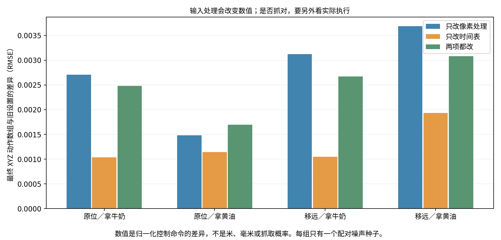

# 12：按官方方式处理输入，还会抓错吗？

**仍会抓错。这次改正了两项输入处理差异，但四条实际执行里，抓取对象没有改变。**牛奶在原位置时，说拿牛奶、拿黄油，都抓牛奶；牛奶移远15 cm后，两句指令都抓奶酪盒。

我们先怀疑：是不是自己的程序处理照片和推理时间表的方式不对，才让模型抓错？这次把这两项改成公开官方代码的做法，再让机械臂实际执行。不是只看内部数字，也没有把示范动作塞给模型。

| 牛奶在哪里 | 我们说什么 | 旧设置抓谁 | 两项改正后抓谁 |
|---|---|---|---|
| 原位置 | 拿牛奶，放进篮子 | 牛奶 | 牛奶 |
| 原位置 | 拿黄油，放进篮子 | 牛奶 | 牛奶 |
| 移远15 cm | 拿牛奶，放进篮子 | 奶酪盒 | 奶酪盒 |
| 移远15 cm | 拿黄油，放进篮子 | 奶酪盒 | 奶酪盒 |

这支持一个有限的结论：**这两项差异没有消除当前的抓错现象。**它不能证明所有代码问题都排除了，也不能证明模型背了训练答案。要查具体原因，还需要把内部信息传递与“最后抓谁”联系起来。

## 我们改了什么？

1. **照片变成数字的方式。**两套程序都缩放同一张照片，但旧程序先变成浮点数再缩放；官方先在整数像素上缩放、限制范围并取整，再转成浮点数。我们照官方顺序重做。
2. **反复修改动作时使用的时间表。**预测一段动作要算30次。旧程序与官方默认做法，在其中两次送给网络的整数时间条件相差1；本次改用官方默认时间表。

同时分别试了“只改照片”“只改时间表”“两项都改”。两种场景、两句指令、四种设置，共16组完整预测。四条新的MuJoCo执行都采用“两项都改”，每条根据新照片计算8轮、每轮执行16步，总共128步。

没有换权重，没有重新训练，没有替换内部隐藏状态。额外系统提示保持关闭；两路相机、任务文字、动作转换和对应初始噪声保持一致。

离线预测的配对输入严格一致；实际执行从同一初态开始，后续照片由各自执行的动作产生，可能逐渐不同。不能说整条执行始终只改了一个词、其他输入都不变。实际英文任务是 `pick up the milk/butter and place it in the basket`，要求放进篮子。

## 看实际执行

- [原位置／拿牛奶：抓牛奶](closed-loop/center_milk_official_official_seed198/actual.mp4)
- [原位置／拿黄油：仍抓牛奶](closed-loop/center_butter_official_official_seed198/actual.mp4)
- [移远／拿牛奶：抓奶酪盒](closed-loop/far_milk_official_official_seed198/actual.mp4)
- [移远／拿黄油：仍抓奶酪盒](closed-loop/far_butter_official_official_seed198/actual.mp4)

“抓谁”用夹爪两侧同时接触该物体、且物体高于初始位置2 cm持续至少5个状态记录来判断。四条分别将牛奶或奶酪盒最高抬起约21.6、21.5、23.9、24.4 cm。这些是实际仿真状态中的高度。

四条在128步结束时都没有触发原任务的牛奶入篮检查。抓起物体不等于完成放置；这个牛奶任务的检查也不能当作“拿黄油”的成功标准。每个条件只有一个配对噪声种子198，只有两份固定初始摆放，不是基准成功率。

## 内部数字变了吗？

变了。照片处理改成官方方式后，第一帧视觉数组相对变化约3.2%；两项都改后，最后一次计算的动作中间数组相对变化约5.0%–5.4%。**内部数字变化，并没有在这四条执行里变成抓取对象的变化。**

图中RMSE表示最终归一化XYZ动作数组的差异大小。它不是米、毫米、抓取概率或理解程度。两项都改时，四组XYZ差异为0.002483、0.001699、0.002669、0.003079；完整数值保存在[summary.json](summary.json)。

另做了一个检查：同一静止画面只编码1帧，或重复17帧再取首帧视觉数组，结果逐项相同。这个结果针对当前使用的VAE，不能据此宣称整个官方VAE实现已经核验完毕。

## 怎么确认实验本身没改错？

- 四组旧设置完整复现了实验09：初始输入、噪声、各层数组、全部30次动作读出、最终动作和视频数组逐项相同。
- 官方照片处理函数来自固定版本源码；在两个现有CPU环境中，用真实torchvision处理同一图片，全部像素与尺寸元数据逐项一致。没有修改模型库或安装依赖。
- 只改时间表时，干净视觉数组不变；其他设置的未来视觉噪声、动作噪声、文字和位置编号保持对应一致。时间表除了两处整数差异，也包含最多5.96e-8的sigma浮点差异，不能称为仅改变整数条件。
- 四条执行的初始状态与旧对照相同；首轮输入照片和预测动作与对应离线记录精确一致。每轮保存并核对实际使用的照片处理、时间表和系统提示开关。
- 接触、抬升和抓取结果从逐步轨迹重新计算；不能仅依据生成视频或模型输出命名抓取对象。

这次在当前Diffusers程序中采用官方输入处理和默认时间表，并未换成完整官方服务。实验11核验了官方网络核心；两项检查的范围不同，不能合并成“官方完整流程已经等价”。此前实验10的四种布局、三个种子也没有全部按本次设置重跑。

## 原始数据和实际脚本

- [汇总与来源校验](summary.json) · [16组预测及逐层差异](result.json) · [运行设置与脚本校验](provenance.json)
- [最终动作数组](actions.npz)：16组，每组16×10；XYZ仍是归一化的控制命令。
- [首次和末次动作读出数组](readouts_first_last.npz)：每组2×16×4096，FP32导出。
- [真实输入像素与首帧视觉数组](vae_arrays.npz)：每组像素1×3×1×192×320，视觉数组1×48×1×10×20。
- [1帧／17帧检查](prefix_controls.json) · [当前CPU环境像素核验](official_pixels_cpu_current.json) · [另一环境核验](official_pixels_cpu_chat.json)
- [四条执行的完成标记](closed-loop/complete.json)；各执行目录保留初始状态、每轮输入与调用记录、归一化／反归一化／实际执行动作、129份状态与画面。
- [照片处理核验脚本](../../scripts/archive/check_cosmos_official_pixels_cpu.py) · [预测脚本](../../scripts/archive/probe_cosmos_pixel_schedule.py) · [MuJoCo执行脚本](../../scripts/archive/rollout_cosmos_pixel_schedule.py) · [汇总画图脚本](../../scripts/archive/present_cosmos_pixel_schedule.py)

完整37个层边界、30次动作读出和视频分支原始PT保留在A6000的 `runtime-pixel-schedule` 目录，未上传。NPZ只保留上面明确列出的真实数组，并非全部内部状态。脚本保留原环境路径与依赖，需要按[推理设置](../../provenance/runtime.md)配置。

官方依据：[照片缩放](https://github.com/NVIDIA/cosmos-framework/blob/cf5d68c00d97ccd2480a2320ed652b92dec63102/cosmos_framework/data/generator/action/utils/transforms.py#L175-L228) · [默认时间表调用](https://github.com/NVIDIA/cosmos-framework/blob/cf5d68c00d97ccd2480a2320ed652b92dec63102/cosmos_framework/model/generator/diffusion/samplers/unipc.py#L68-L106)。权重、代码固定版本及其他已知差异见[运行方式核验](../../notes/runtime-contract-audit.md)。
