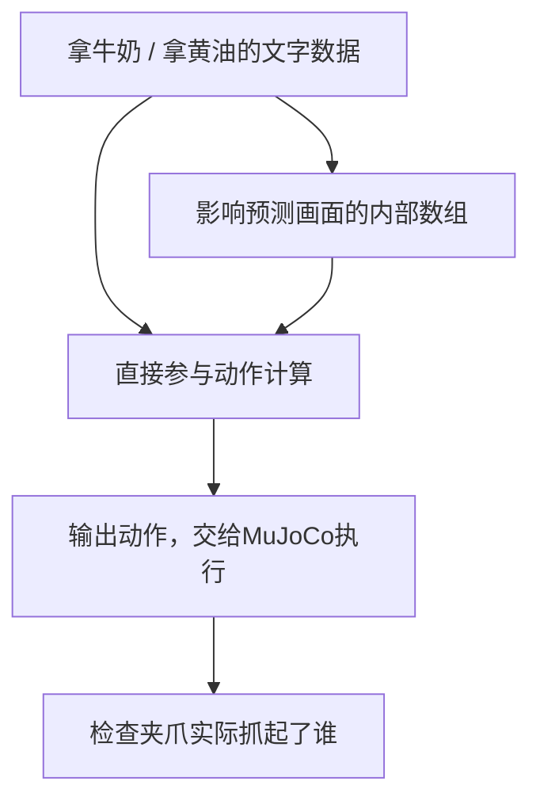
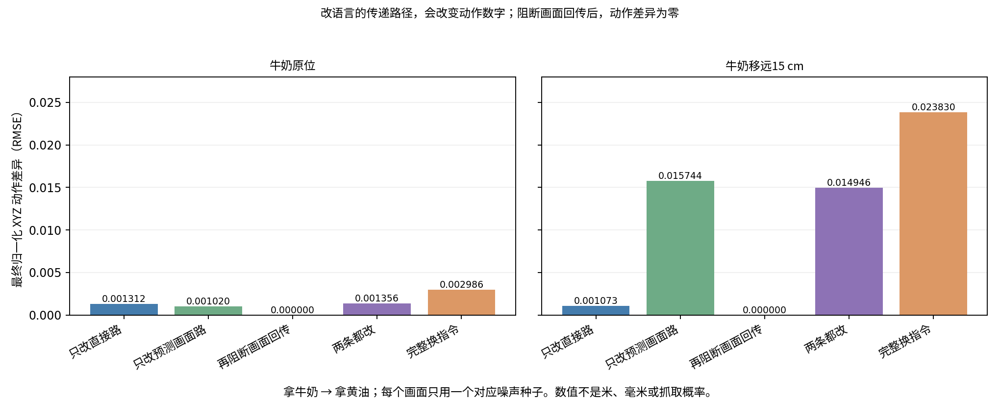
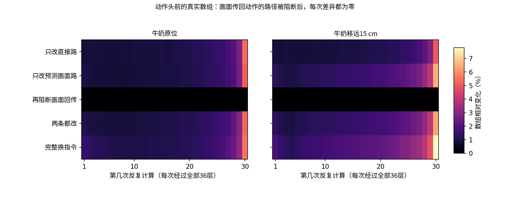

# 13：我们的话起作用了，为什么还是没换目标？

**语言确实能改变动作计算，既有直接影响，也有经过预测画面的影响；但这轮六条实际执行，没有一条改抓黄油。**牛奶在原位时都抓牛奶，移远15 cm后都抓奶酪盒。

所以，不能再简单解释成“文字没传进动作网络”。现在剩下的问题是：它对词有反应，为什么这种反应没有变成正确选物体？这轮还没有回答这个问题，也没有证明它背了某条训练示范。

## 我们具体干了什么？

模型同时计算未来画面和动作，两者在内部会互相读取。我们把“拿牛奶”和“拿黄油”的运行都保存下来，然后只在指定路线里，换入另一句指令的文字数据。

两次来源运行看的是**同一张当前照片**，用的是同一份初始噪声。没有喂专家动作，没有换物体位置，没有重新训练，也没有把语言影响放大。

这张图只说明本次分开的两种影响方式。模型里还有照片读取和反复计算产生的反馈，不能把两条路线当成互不相干的独立模块。

| 内部怎么改？ | 牛奶原位时抓谁？ | 牛奶移远15 cm后抓谁？ |
|---|---|---|
| 让动作直接读“拿黄油”；把画面读取固定为“拿牛奶”的结果 | 牛奶 | 奶酪盒 |
| 只让预测画面读“拿黄油”，再让动作读取这些变化；当前画面读取固定 | 牛奶 | 奶酪盒 |
| 同时改这两种读取；当前画面的读取仍固定 | 牛奶 | 奶酪盒 |

每格是一条128步实际执行，不是成功率。正常说“拿牛奶”和“拿黄油”的对照来自[实验12](../12-pixel-schedule/README.md)，也分别抓牛奶／奶酪盒。后续照片会随各自动作变化；每次预测都从**该轮同一张新照片**重算两句指令的来源，没拿另一条轨迹的照片混进来。

## 一个关键对照：预测画面真的会影响动作吗？

会。在同一张静止画面上，只让预测画面读取“拿黄油”，最终动作数字改变了。

接着把生成分支读到的画面数据固定为“拿牛奶”的原结果：预测画面仍发生变化，但**全部30次动作中间数组、动作头输出、31份动作采样状态和最终动作，都逐项回到原结果**。两种布局、两个换词方向，共四组都如此。

这支持“语言能通过预测画面的内部数据影响动作”。这里固定的是生成分支所有读口上的画面K/V，也影响预测画面内部的读取；它不是只剪断一条边、其余视频过程完全不变的实验。它没有证明这条路线传递了正确物体身份，更没有证明它造成了抓错。

图中数字只是最终归一化XYZ动作数组的差异（RMSE），不是米、毫米、理解程度或抓取概率。“两条都改”也不等于两条效应相加。完整换词能精确复现“拿黄油”的自然输出，但这个自然输出本身没有抓黄油。

## 看实际录像

- 原位：[直接路](closed-loop/center_milk_to_butter_direct/actual.mp4) · [预测画面路](closed-loop/center_milk_to_butter_indirect/actual.mp4) · [两条都改](closed-loop/center_milk_to_butter_joint/actual.mp4)
- 牛奶移远：[直接路](closed-loop/far_milk_to_butter_direct/actual.mp4) · [预测画面路](closed-loop/far_milk_to_butter_indirect/actual.mp4) · [两条都改](closed-loop/far_milk_to_butter_joint/actual.mp4)

六条分别把牛奶最高抬起约21.48–21.50 cm，或奶酪盒约23.93–24.17 cm。判定要求：夹爪两侧同时接触这个物体，而且抬高超过2 cm，持续至少5份状态记录。六条结束时都没有触发原牛奶任务的入篮检查；抓起来不等于放置成功。

## 现在能说什么？

**“模型对这个词有反应”与“模型按这个词选物体”是两件事。**这轮证明了前者的两条计算路线，但六条执行没有显示后者被改好。

还分不开的解释包括：另一句指令没有提供有效的目标信息；有目标信息，却没压过当前布局对应的动作偏好；这些变化主要在改运动细节，没有改变选物体。不能只凭这轮热力图在三者中选一个。

下一步先找一个正对照：**同一初态，两句指令自然就能让策略抓不同的正确物体**，再做这些内部替换。这样才知道换进去的运行确实有另一种正确行为，而不是把一份仍抓错的结果搬来搬去。

需要核验时再看：真实数值、代码、检查与范围

两份固定初态，每份仅一个配对噪声种子198；milk↔butter双向。4组自然基线、36组内部替换，共40组完整预测；每组36层×30次去噪。六条闭环只做milk→butter的direct／indirect／joint，每条8轮×16步；阻断对照只做离线数值核验，没有新增闭环录像。

输入沿用实验12核验过的官方整数像素处理与默认时间表，系统提示关闭，JSON格式、10维rot6d动作与转换保持原设置。并非完整官方服务等价。固定权重仍是社区 `fwd4xl/cosmos3-nano-policy-liberoall-5k`，不是所有Cosmos的结论。

### 路线在代码里到底怎么分？

| 标签 | 读另一句文本K/V的查询 | 固定为原运行的画面K/V |
|---|---|---|
| `full` | 当前画面、未来画面、动作全部查询 | 不固定 |
| `direct` | 动作查询 | 当前＋未来画面 |
| `indirect` | 未来画面查询 | 当前画面 |
| `indirect_blocked` | 未来画面查询 | 当前＋未来画面 |
| `joint` | 未来画面＋动作查询 | 当前画面 |

固定作用于所有生成查询读取的K/V；direct仍允许动作影响视频，但变化的画面K/V不能再传回动作。indirect允许未来画面与动作反馈。joint与full还差当前画面GEN隐藏状态的读取，不能把差值直接叫“当前照片的语义贡献”。

在真实attention原processor里重算全部生成查询，然后按查询组取相应结果；修改投影后、归一化和RoPE之前的原始K/V。保留Q、文本分支输出、动作在线K/V、残差和MLP。人工组合状态可能不在自然运行分布内，结果不能当作自然机制占比。没有改模型库。

### 怎样确认干预没接错？

- CPU小模型13项检查通过，使用真实Cosmos3 decoder和多次反馈，未初始化CUDA；[记录](cpu_controls.json)。
- 实际权重32项检查通过：4组基线复现实验12；空替换、零强度、同一来源替换和原画面固定都精确回到基线；全路径换词精确复现另一句；indirect首次第一层动作不变；blocked动作全过程精确回到原结果，但视频数组确实改变。
- 全路径和无效干预在运行时核对了全部生成查询的1110个边界（30×37）。这些完整GEN数组仅在内存中比较，没有落盘；归档的PT可复验动作与视频全过程，不能事后重比全部GEN边界。
- 六条初态和首轮输入与离线对照一致；首轮动作逐项一致。每轮保存当前照片、两句来源和补丁的真实数组，以及输入校验、seed和路径完整性记录。
- 抓谁由逐步接触与高度重新计算，实际执行动作等于官方转换后再限幅的7维命令。没有用预测视频判断成功。

每格比较该次全部16×4096个动作读出坐标的相对RMS变化。黑色的阻断行是精确零差异；其他颜色只表示数字改变，不表示“牛奶概念”、意图或错误层。每次计算均经过全部36层。

### 数据与复现范围

- [重新计算的汇总](summary.json) · [36组逐层/逐次差异与32项检查](result.json) · [来源](provenance.json) · [离线完成记录](offline_complete.json)
- [动作NPZ](actions.npz)：40组真实16×10归一化动作；[首末动作读出NPZ](readouts_first_last.npz)：每组2×16×4096，FP32导出，非全部内部状态。
- [六条执行完成记录](closed-loop/complete.json) · [执行汇总](closed-loop/result.json)；各目录保留129张画面／状态、8轮输入、动作转换前后和调用核验。chunk目录保留各预测元数据和动作JSON。
- [路径助手](../../scripts/archive/cosmos_attention_routes.py) · [CPU测试](../../scripts/archive/test_cosmos_attention_routes_cpu.py) · [实际预测](../../scripts/archive/probe_cosmos_language_routes.py) · [实际执行](../../scripts/archive/rollout_cosmos_language_routes.py) · [汇总画图](../../scripts/archive/present_cosmos_language_routes.py)

完整动作hidden、读出、动作头速度、31份FP32采样状态、视频latent与基线原始K/V缓存保留在A6000的 `language-route-isolation/attempts/20261003T132000Z`，没有上传。脚本依赖原主机路径和现有权重，不能承诺下载此仓库即一键复现。[已转存文件校验](source_inventory.json)与全仓库manifest分别核对来源和发布文件。

FP32的初始未来视觉噪声未单独保存；事后独立复验的是实际网络收到的BF16初始视觉／动作tokens和FP32动作初态。未来视觉噪声配对还依靠已核对的同seed、同shape新生成器代码，不能说全部FP32噪声原数组都已归档。

第一轮程序因日志字段重复退出，发生在结果记录处；修正后另建上述attempt重新运行。失败记录保留在[instrumentation_failure.json](instrumentation_failure.json)，不是模型实验结果，也不算模型bug。本次未删除任何失败产物。Cosmos服务在六条执行完成后关闭，显存已释放。

方法参照：[真实attention实现](https://github.com/huggingface/diffusers/blob/fef717ffb01f407d2637584ed936c16db908587a/src/diffusers/models/transformers/transformer_cosmos3.py#L67-L122) · [Action Atlas](https://arxiv.org/html/2603.19233v1) · [反事实目标与视觉偏置研究CAG](https://arxiv.org/html/2602.17659v2)。已有研究不替这份权重证明根因。

