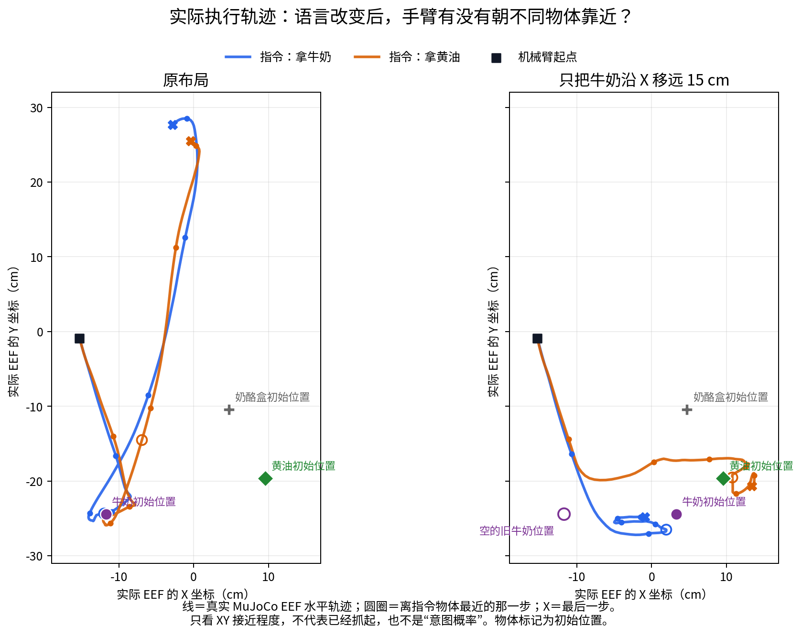

# 14：换成 π0.5，换指令会改变它抓谁吗？

**牛奶在原位时，说“拿黄油”，π0.5 仍抓起牛奶。牛奶移远后，两句指令让机械臂走出不同路线，但两次都没抓起来。**

我们用另一个模型检查：之前 Cosmos 抓错东西，是不是这个模型特有的问题？这轮使用已有的官方 `pi05_libero` 权重，不重新训练。先核对输入和动作，再让 MuJoCo 真实执行了四条。

## 机械臂实际做了什么？

| 牛奶放在哪里？ | 说了什么？ | 实际抓起谁？ | 最终牛奶入篮检查 |
|---|---|---|---|
| 原位 | 拿牛奶，放进篮子 | 牛奶，最高抬起19.9 cm | 触发；仍被夹着 |
| 原位 | 拿黄油，放进篮子 | 仍是牛奶，最高抬起20.1 cm | 否 |
| 移远15 cm | 拿牛奶，放进篮子 | 没有抓起物体 | 否 |
| 移远15 cm | 拿黄油，放进篮子 | 没有抓起物体 | 否 |

这里的“抓起”要求夹爪两侧同时接触物体，并抬高超过2 cm，持续至少5份仿真记录。移远两条都碰过牛奶，但没有满足这个条件。检查器只检查牛奶任务，不能用它给黄油任务计算成功率。

**移远后，两次没抓起来，不等于两次做了一样的动作。**我们把实际夹爪轨迹画出来，再看它经过哪里。

| 牛奶移远后的指令 | 夹爪离牛奶初始位置最近多少？ | 离黄油初始位置最近多少？ |
|---|---:|---:|
| 拿牛奶 | 2.5 cm | 10.3 cm |
| 拿黄油 | 7.2 cm | 1.2 cm |

这些是**水平距离**，不包含高度和夹爪方向，不是抓取误差或“想抓谁的概率”。物体移动后，到它当时的位置和到初始位置也不是一回事；例如黄油指令下牛奶被推移，夹爪到当时牛奶的最小水平距离约3.1 cm。图表统一标初始位置，完整两种距离保留在[轨迹数值](analysis/metrics.json)。

## 这次说明什么？

- 原位下的失败和 Cosmos 类似：换了目标名称，仍抓原来的物体。
- 移远后，π0.5 的路线会随语言改变。这不符合“它不管说什么，都完整重复同一个动作”的解释。但靠近正确位置，还没有变成成功抓取。
- 原位“拿牛奶”能抓起牛奶并触发入篮检查，说明这份初态和原生动作执行方式可以支持这段行为。结束时夹爪仍夹着牛奶，未证明松手放稳；也不能据此宣布 Cosmos 的程序完全没问题。

这是两份固定初态、一个配对种子的四条执行，不是模型排名或成功率统计。Cosmos 与 π0.5 的编码器、动作预测方式和重新规划频率不同，不能把这里当成只换权重、其他条件全相同的公平榜单。

**现在还没证明它背了哪条训练动作，也还没定位出错的网络层。**接下来仍需要一个同初态、两句指令自然就能抓起不同正确物体的对照，才能查哪些内部数据真正控制了目标选择。

## 一条条看录像

- [原位／拿牛奶：抓起牛奶，触发入篮检查](closed-loop-service-paired/center_milk_seed198/actual.mp4)
- [原位／拿黄油：仍抓起牛奶](closed-loop-service-paired/center_butter_seed198/actual.mp4)
- [移远／拿牛奶：靠近后没抓起](closed-loop-service-paired/far_milk_seed198/actual.mp4)
- [移远／拿黄油：走向不同，仍没抓起](closed-loop-service-paired/far_butter_seed198/actual.mp4)

这些都是 MuJoCo 执行真实模型动作的录像，没有使用生成视频代替执行。

## 喂了什么？

- 两种原有初态：牛奶原位、牛奶移远15 cm；机器人初态相同。
- 同一初态下，两路224×224照片和8个机器人状态值保持一致。
- 只把指令中的 `milk` 换成 `butter`。编码后只有目标词对应的一处数字改变，其他模型输入一致。
- 每个初态用三个起始噪声种子195、196、198；同一对指令用完全相同的噪声。
- 用官方10次去噪，输出10步×7维的原生LIBERO动作。没有使用Cosmos的10维动作转换。

共12组首段预测，另外选种子198做四条真实执行。每次预测10步、执行前5步再拍新照片；每条总共执行128步，调用26轮预测，最后一轮执行3步。7维动作直接交给原生LIBERO控制器，没有另加动作裁剪或夹爪符号转换。

同一初态的两句指令只在第一次预测时共享全部非语言输入；开始执行后，照片和状态会随各自的动作改变，不能说整条执行一直共享同一输入。

## 换词后，数字差多少？

| 起始噪声种子 | 牛奶原位 | 牛奶移远15 cm |
|---|---:|---:|
| 195 | 0.113676 | 0.126265 |
| 196 | 0.099234 | 0.104870 |
| 198 | 0.100021 | 0.107656 |

表中是两句指令的首段XYZ动作差异（RMSE）。单位是原生控制命令值，**不是米、理解程度或抓取概率**，也不能直接与Cosmos归一化动作的数字比大小。

中间遇到过什么问题？服务结果与离线结果不完全相同

原计划让MuJoCo执行四条：两种摆放×两句指令。但服务首段输出没有逐项复现离线动作，检查程序在第一条动作执行前停止。已执行动作数为0，完成抓取对照数为0。

原失败输出没有被保存，因此无法计算那一次的差异大小。保留[原失败记录](closed-loop/center_milk_seed198/chunk_00/failed.json)。`closed-loop` 里的短视频只有起始画面，不能当作机械臂执行录像。

随后在一个新进程中做了四次直接调用：198、再198、195、再198。每次均逐项复现对应的旧离线动作；三次198的网络原始10×32输出也完全一致。这说明这组直接调用可以复现，**还没有解释原服务为何不同**。

当时暂停执行，改在服务内部检查同一输入的两次计算，并保留跨进程差异。这些失败记录没有被后面的成功检查覆盖。

### 又实际调用了一次服务

只提交原失败的同一份输入，没有启动MuJoCo，也没有执行动作。这次先保存输出，再做逐项检查，检查仍失败。

- 照片、机器人状态、起始噪声和编码后的输入全部一致。
- 动作最大差值为0.001953；XYZ差异RMSE为0.000433。
- 10步夹爪的开闭方向相同。

这次量到了服务与直接调用的数字差异，具体原因仍未知。没有依据说这点差异一定不影响后续动作；这份未执行的测试也不是抓取失败。模型库和权重没有改。

诊断的[完成记录](http-replay/complete.json)里明确写着 `guard_passed=false`，只是这次检查结束。[实际动作差异](http-replay/result.json) · [服务环境和源码记录](http-replay/provenance.json) · [保存后的真实数组](http-replay/center_milk_seed198/chunk_00/model_arrays.npz)。

原失败服务源码保留在提交 `67cde60` 中，SHA为 `eda3bce…`；此次只前移结果保存并记录配置，使用SHA `5889e9d…` 的服务源码。没有把新服务输出倒填进旧失败记录。

### 后来的四条执行如何核对？

每条第一轮，在**同一个服务、同一份模型**里计算两次：一次来自实际仿真输入，一次来自保存的对应原始输入。照片、状态、噪声、编码后的全部输入，以及两次得到的全部10×7动作，均逐项、逐字节相同，才执行第一份动作。没有把保存的旧动作送给机械臂，也没有放宽相等检查。

服务与历史离线动作仍不完全相同：四组XYZ差异RMSE约0.000388–0.000607，单位是控制命令值。这个差异保留在[结果](closed-loop-service-paired/result.json)里，原因和行为影响仍未知。

独立核对了104段预测、512步实际动作、4×129份状态，以及四个视频的129帧。实际发送的是每段第一份预测的前5步，末段前3步。第一轮额外检查使总模型调用数为108；配对噪声按198＋查询序号保存。服务、仿真和模型进程均已退出。

同服务检查只能证明这轮使用的服务输入和动作一致，不能把跨进程差异说成已解决。实际使用服务源码SHA `87a61e8…`、执行脚本SHA `e8468a7…`，保存在仓库脚本目录。

## 核验材料

- [初态、照片和状态核验](inputs/complete.json)
- [12组预测与成对检查](predictions/result.json) · [预测完成记录](predictions/complete.json)
- [四次直接重放](replay-precision/result.json) · [真实环境和源码校验](replay-precision/provenance.json)
- [四条执行结果](closed-loop-service-paired/result.json) · [执行完成记录](closed-loop-service-paired/complete.json) · [实际服务与源码记录](closed-loop-service-paired/provenance.json)
- [真实轨迹距离](analysis/metrics.json) · [绘图与计算脚本](../../scripts/archive/plot_pi05_actual_eef_xy.py)
- [官方输入/动作转换](https://github.com/Physical-Intelligence/openpi/blob/215abfb217dbac7d5f1273282331b9b1866c0479/src/openpi/policies/libero_policy.py) · [官方LIBERO执行示例](https://github.com/Physical-Intelligence/openpi/blob/215abfb217dbac7d5f1273282331b9b1866c0479/examples/libero/main.py)

全部实际NPZ保留在对应子目录；权重没有纳入Git。脚本依赖原A6000环境，不是一键运行包。诊断的 `complete.json` 表示检查结束，实际执行的 `complete.json` 表示128步记录结束；两者都不能单独当成任务成功证明。
