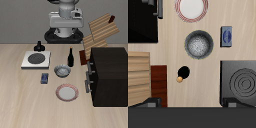

# 15：同一个画面，说碗抓碗，说酒瓶抓酒瓶

**这次，当前 Cosmos Policy 确实随指令改变了抓取对象。但两条都没有在128步结束时完成柜顶放置。**

之前的牛奶场景里，说“拿黄油”仍抓牛奶。我们需要先找一个正常就能换对目标的对照，才能去内部追踪：什么信息让它改抓了物体？这轮没有换模型、重新训练或替换内部数组。

## 怎么试？

选原生 LIBERO_GOAL 的两条指令：

- `put the bowl on top of the cabinet`：把碗放到柜子上。
- `put the wine bottle on top of the cabinet`：把酒瓶放到柜子上。

两份任务的物体、柜子、摆放区域和物理初态配置完全相同。我们统一使用**碗任务4的初态0**，恢复到同一份已经预热的快照；没有分别使用两任务各自的默认初态，也没有重复预热。

左边是固定相机，右边是手腕相机，各256×256。模型只收到两路画面和指令，以及原有动作任务格式；没有给它专家动作或额外机器人状态输入。每轮预测16步动作，用原来核验过的转换交给MuJoCo执行，再拍新照片。每条8轮、128步。

## 实际做了什么？

| 指令 | 真正抓起谁？ | 最大抬升 | 柜顶放置检查 |
|---|---|---:|---|
| 碗 | 碗，没有抓起其他物体 | 28.6 cm | 全程未触发 |
| 酒瓶 | 酒瓶，没有抓起其他物体 | 30.0 cm | 中途触发，结束时未触发；酒瓶仍被夹着 |

“抓起”要求夹爪两侧同时接触物体、抬高超过2 cm，并持续至少5份记录。碗首次在52–56记录满足，酒瓶在42–46满足。

- [看碗指令的实际执行](policy/closed-loop/bowl/actual.mp4)
- [看酒瓶指令的实际执行](policy/closed-loop/wine/actual.mp4)

视频是 MuJoCo 执行模型动作的录像，**不是生成视频**。碗最后已不再被双指夹着；酒瓶最后仍被夹着。原生柜顶检查没有单独要求松手或静止，中途触发不能说已经放稳。

## 现在该怎样解释？

**不能把这个权重概括成“无论说什么，都只做同一个动作”。**在这份共同初态下，两句原生指令让它抓起了对应的不同物体。

这也没有抹掉牛奶场景的失败：保留牛奶任务的场景、改说拿黄油，仍然抓牛奶。只是我们现在知道，正常的语言选目标能力在另一组场景里可以出现，失败需要结合场景和任务关系解释。

之前的牛奶→黄油对照打破了原生任务的目标与位置对应关系，属于泛化测试，不是原生黄油任务。[两份OBJECT任务的区别](../14-pi05-target-control/README.md#这是官方黄油任务吗)。这一轮GOAL任务的物理配置相同，减少了那种混淆。

**还不知道：牛奶场景为什么没按词换目标，也没有证明它背了训练轨迹。**本轮没有内部干预，不能据此定位出错层；也不能把同画面抓对一次写成所有场景都能理解指令。

下一步用这组自然抓对目标的运行作来源，做有完整重放和空改对照的内部替换，检查哪些信息能改变实际抓取对象。先验证替换方法，再解释效果。

输入、内部数组和动作真的核对了吗？

已核对：

- 两条初始状态、物体及柜子位置、相机和观测，共63项逐项一致；三份PNG逐字节一致。
- 恢复后统一重置控制器目标，两条10项内部状态逐字节相同，包括关节参考值、控制目标、增益和夹爪当前动作。没有覆盖控制器的原有关节参考。
- 两句各重复算首轮，实际执行首轮也精确复现对应的保存结果：首步输入、初始噪声、准备后的数组、30次动作读出和预测值、31份动作采样状态、最终动作及视频数组均逐字节一致。
- 8轮配对的实际视觉与动作FP32初始噪声一致，30次推理时间表一致。
- 两条各128步动作、129份状态和PNG，视频各129帧。保存的16×10动作，经原有逆归一化、旋转和夹爪转换、裁剪后，与真实发送的7维控制命令精确对应。

真实张量保留在每个`states.pt`中，权重没有纳入仓库。动作读出为BF16 `[30,16,4096]`，动作预测值为BF16 `[30,16,64]`，采样状态为FP32 `[31,1,16,64]`。它们是实际保存的数据，还没有被解释成“碗概念”或意图概率。

两句的文本长度为119／120 token；因此这是自然指令对照，**不是把词义变化与序列长度、位置影响全部分开的机制实验**。第一轮画面一致，后续画面会随各自的动作改变。

使用现有社区权重`fwd4xl/cosmos3-nano-policy-liberoall-5k`和已核对两项输入处理的当前程序；没有宣称完整官方服务等价。policy模式、LIBERO域5、raw10、chunk16、30次去噪、fps20、guidance1、system关闭。每轮种子198＋查询序号；一个共同初态、一组配对噪声，不是基准成功率。

两个任务分别使用解析后的原生柜顶目标检查。底层物理环境始终是碗任务，所以它返回的`done`只能评价碗；没有拿这个值评价酒瓶，也没有提前停止固定128步。酒瓶柜顶检查共触发34份记录，最终128步为false。

同初态和控制器检查证明本次配对成立，没有声称恢复了采集预热阶段未保存的全部Python历史记忆。运行结束时，两个进程均正常退出、GPU已释放；没有重跑或扩大实验。

## 数据入口

- [输入采集元数据](inputs/metadata.json) · [63项核验](inputs/checks.json) · [采集完成记录](inputs/complete.json)
- [首轮重复与噪声核验](policy/baseline_complete.json) · [服务完成记录](policy/server_complete.json)
- [两条实际结果](policy/closed-loop/result.json) · [执行完成记录](policy/closed-loop/complete.json) · [运行源码和设置](policy/closed-loop/provenance.json)
- [碗逐步状态](policy/closed-loop/bowl/trajectory.json) · [酒瓶逐步状态](policy/closed-loop/wine/trajectory.json)
- [实际碗任务配置](../../provenance/libero-goal-bowl-task.bddl) · [实际酒瓶任务配置](../../provenance/libero-goal-wine-task.bddl)
- [采集脚本](../../scripts/archive/collect_cosmos_goal_pair.py) · [实际服务](../../scripts/archive/serve_cosmos_goal_pair.py) · [实际执行脚本](../../scripts/archive/rollout_cosmos_goal_pair.py)

脚本依赖原A6000环境；`.pt`需要现有PyTorch环境读取，不是一键运行包。`complete.json`只证明采集或运行结束，成功与否需要看上面的独立行为检查。
